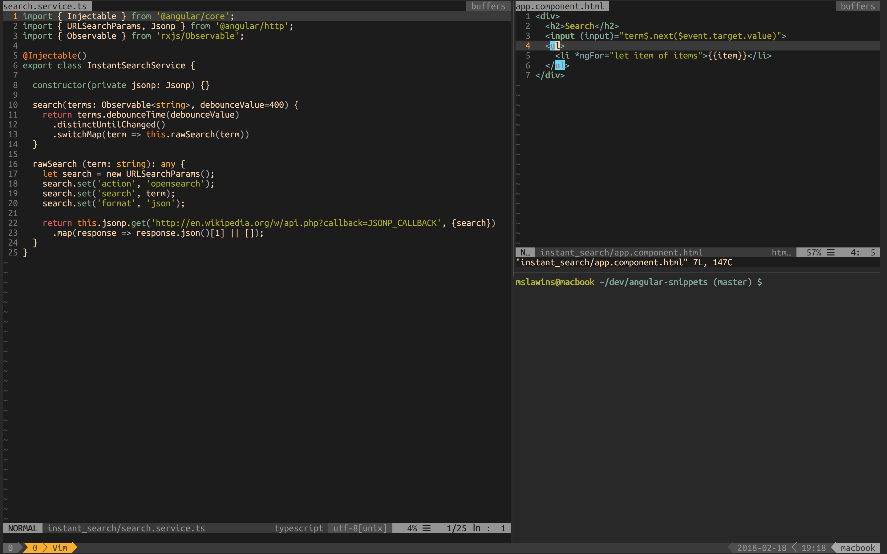

## Configs

This repository contains configs I personally use. Everything is set up to work cross platform with Dropbox
with as little installation as possible.

Note that:

* ~/.vim/dein is hardcoded location where dein stores plugins, if changed vim/dein.vim must be adjusted

### Instalation

1. Install dein.vim

curl https://raw.githubusercontent.com/Shougo/dein.vim/master/bin/installer.sh > installer.sh
sh installer.sh ~/.vim/dein

2. Source settings file via script or manually (Note: script will overwrite your files)

python3 install.py

3. Run vim and install plugins

:call dein#install()

4. Compile YCM

cd ~/.vim/dein/repos/Valloric/YouCompleteMe
./install.py

5. Run vim and recache plugins

:call dein#recache_runtimepath()

6. Use iTerm2 preferences to set up color scheme

7. Happiness

### Example

